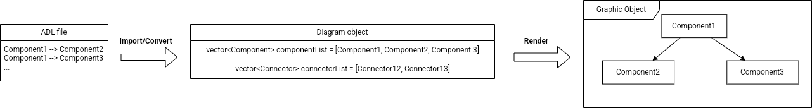
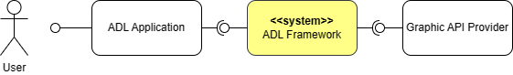

# SW Associate Architecture
## 1. Overview
_**Task 1: Draw the operation and business environment of the system**_

With the aim of solving a problem by a computer, programmers need to understand that problem, then learn a programming language and use it to tell a computer how to solve that problem over and over. But later, problems in the real world has been evolved to be much more complex and abstract day by day. To adapt with the changes in the problem's requirements, it is necessary to draw a bigger picture of how a computer solves a problem, and from that, we can find a more general way to resolve the problem, called Software architecture. It is a research field that makes fundamental structure choices for designing a system and shifts the developer's focus from lines-of-code to coarser-grained architectural elements (software components and connectors) and their overall interconnection structure. A good software architecture can help the organization to reduce the cost of developing applications and increase the potential for maintaining and extending further products.
To support architecture-based development, formal modeling notations, analysis and development tools that operate on architectural specifications are needed. Architecture description languages (ADLs) has been proposed as the answer. Generally, an ADL for software development focuses on the high-level structure of the overall application to present the architect's ideas and thinking rather than the implementation of any specific source module. ADL can be represented as few type of diagrams as:
- Component and Connector View
- Deployment View
- Sequence Diagram
- Module View
- Work Assignment View
- Install View

Figure 1. 

Each diagram consists of multiple entities for architectural representation, called Element. As described in Figure 1, it can be classified into five types:
- Component
- Connector
- System
- Port
- Role

Figure 2. 

Figure 2. shows the workflow of an ADL system. From an ADL file, the system will convert into a Diagram object, which contains the information of the Diagram, lists of Elements, and its relationships. Next, the Diagram object is rendered to a Bitmap to provide a graphical view for the user.

Figure 3.

For the sake of rendering a diagram into a Bitmap object to display on a screen, or saving it as a picture, it is required to use a Rendering API. Figure 3. illustrates the general pipeline of common Rendering API. In general, we can provide information of 3D coordinates, and then the graphic pipeline transforms these into colored 2D pixels on the screen. The graphic pipeline can be divided into several steps which can be executed parallelly on GPU. The processing cores run small programs on the GPU for each step of the pipeline. These small programs are called shaders. There are two shaders that are programmable: vertex shader and fragment shader.

In this document, we proposed to design an ADL Framework to support editing and rendering ADL by a Graphic API. The Framework can be specifically implemented on the Windows operating system under a third-party ADL UI Application.

//TOD: Stakeholder table
Stakeholder | Interest in architecture

**_Task 2: Define the input and output of the system_**
## 2. Requirements
### 2.1. Functional Requirements

### 2.2. Non-functional Requirements
### 2.3. Quality Attributes
## 3. Architecture
## 4. Modules
# Appendix
## A. Domain Model

| **UC_01**          | Create Diagram |
|-----------------|---|
| Description     | Creating an empty diagram  |
| Actor           | Application  |
| Pre-condition   | None  |
| Post-condition  | A empty diagram has been created A blank graphic object has been create |
| Basic flow      | 1. Application requests to create diagram to App API   2. App API requests Diagram Controller to create a diagram   3. Diagram  Controller create a Diagram object   4. Diagram Controller request Graphic Controller to create a Graphic object   Graphic Controller create a Graphic object   Graphic Controller register a callback to Graphic API |
| Additional Flow |   |

| **UC_02**          | Render diagram |
|-----------------|---|
| Description     | Rendering a diagram object to Bitmap object  |
| Actor           | Render API Provider  |
| Pre-condition   | Diagram has been loaded / created  |
| Post-condition  | A Bitmap object has been created  |
| Basic flow      |   |
| Additional Flow |   |
## B. Quality Scenarios
## C. Quality Scenarios Analysis
## D. Candidate Architectures
## E. Candidate Architecture Evaluation
## F. Architecture Design
## G. Architecture Evaluation (ATAM)
