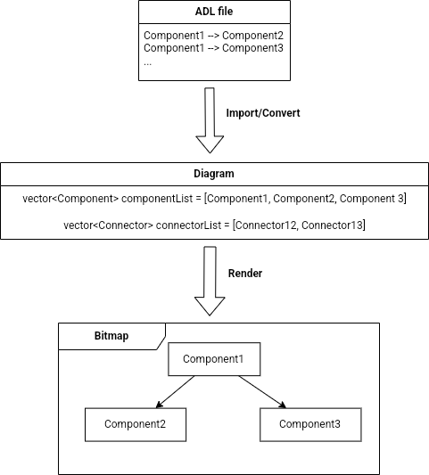
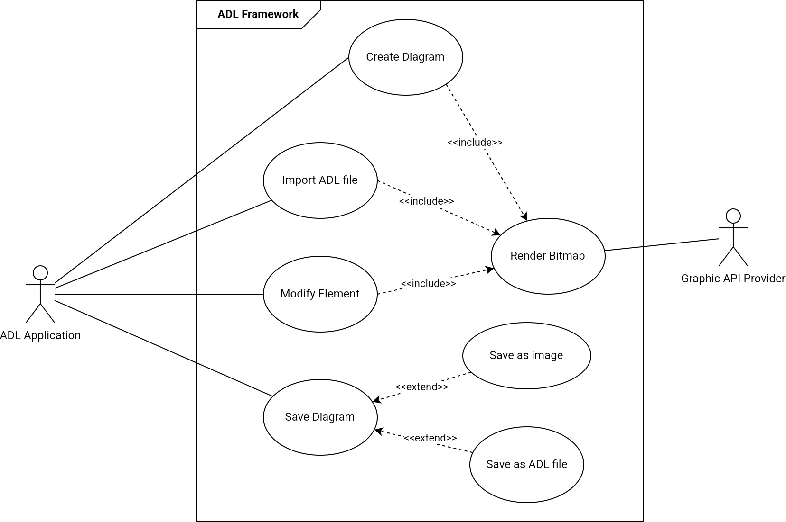
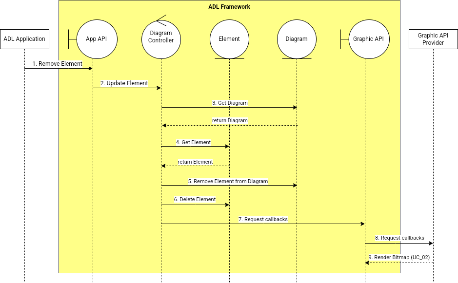
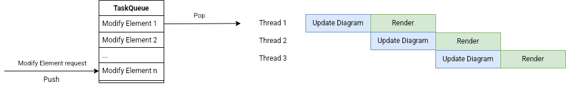
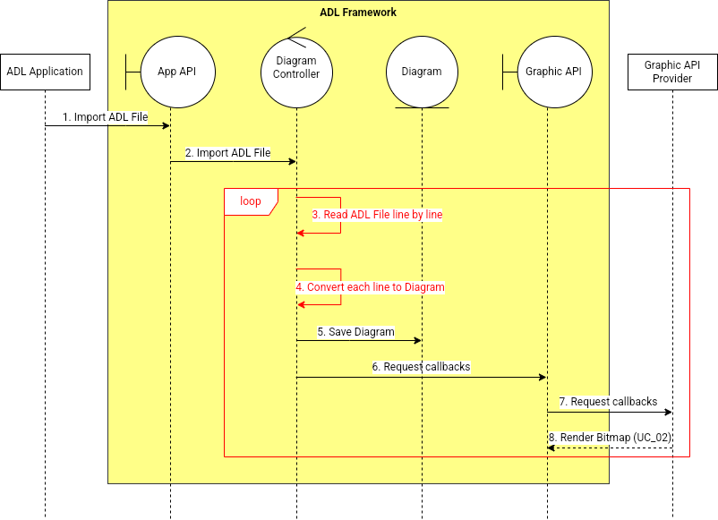
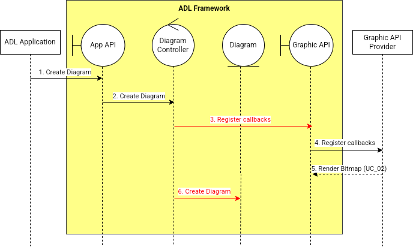
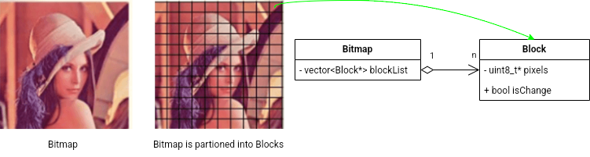
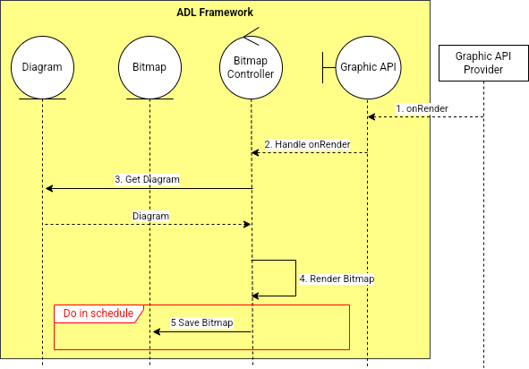
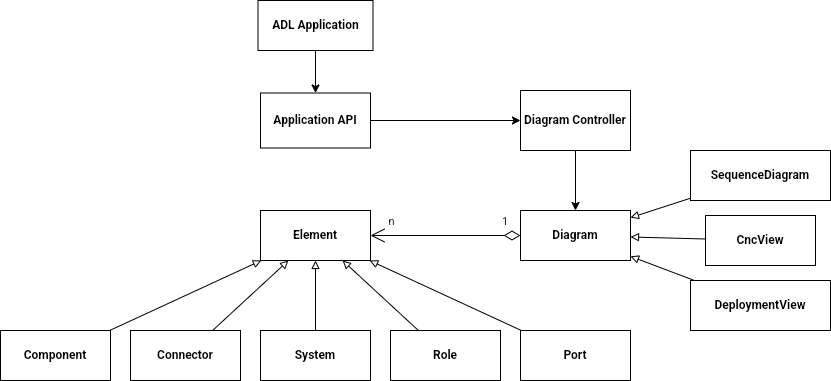
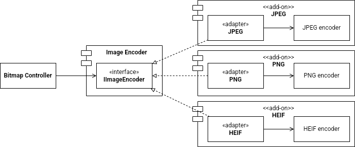

# SW Associate Architecture
## 1. Overview
_**Task 1: Draw the operation and business environment of the system**_

With the aim of solving a problem by a computer, programmers need to understand that problem, then learn a programming language and use it to tell a computer how to solve that problem over and over. But later, problems in the real world have evolved to be much more complex and abstract day by day. To adapt with the changes in the problem's requirements, it is necessary to draw a bigger picture of how a computer solves a problem, and from that, we can find a more general way to resolve the problem, called Software architecture. It is a research field that makes fundamental structure choices for designing a system and shifts the developer's focus from lines-of-code to coarser-grained architectural elements (software components and connectors) and their overall interconnection structure. A good software architecture can help the organization to reduce the cost of developing applications and increase the potential for maintaining and extending further products.
To support architecture-based development, formal modeling notations, analysis and development tools that operate on architectural specifications are needed. Architecture description languages (ADLs) have been proposed as the answer. Generally, an ADL for software development focuses on the high-level structure of the overall application to present the architect's ideas and thinking rather than the implementation of any specific source module. ADL can be represented as few types of diagrams as:
- Component and Connector View
- Deployment View
- Sequence Diagram
- Module View
- Work Assignment View
- Install View

Figure 1. Diagram's elements

Each diagram consists of multiple entities for architectural representation, called Element. As described in Figure 1, it can be classified into five types:
- Component
- Connector
- System
- Port
- Role

Figure 2. Workflow of an ADL sytem

Figure 2. shows the workflow of an ADL system. The input is an ADL file, which is a text file written following a programming-like syntax. It describes what Elements are taking part in the Diagram, and how they connect to each other. From that, the system will convert into a Diagram object, which contains the information of the Diagram, lists of Elements, and their relationships. Next, the Diagram object is rendered to a Bitmap to provide a graphical view for the user.

Figure 3. The general pipeline of a common Graphic API (OpenGL)

For the sake of rendering a diagram into a Bitmap object to display on a screen, or saving it as a picture, it is required to use a Graphic API. Figure 3. illustrates the general pipeline of a common Graphic API. In general, we can provide information of 3D coordinates, geometries and texture materials (fragment), and then the graphic pipeline transforms these into colored 2D pixels on the screen parallel by GPU.

Figure 4. The system boundary of the proposed ADL Framework

In this document, we proposed to design an ADL Framework to support editing and rendering ADL. Figure 4. describes the boundary of our ADL Framework system. The Framework is specifically implemented on Windows OS and provides an interface for ADL UI Application to call our API function. We also need a Graphic API, which is given by a Graphic API Provider to render the Diagram into a Bitmap object. Besides, it's required to have a Storage component for reading and writing files and also a Graphic View for showing our rendered Bitmap. Nevertheless, we don't have a plan for using any external Storage or Graphic View component that is not provided by Windows OS, so we decided to not take them into account and will mention it as a part of the environment system.

In the below table, we illustrate the Business Driver related to our system.
| **Stakeholder** | **Interest in architecture** |
|---|---|
| User | - Fast Bitmap rendering and quick export to Image/ADL file - Diagram and Element style can be customized (color, line width, shape, etc...) |
| ADL Application Developer | - Run stability - Provide more useful features - Less resource consumption (CPU, Memory) |
| Project Manager | - Less Development & Maintenance cost |
| Technical Leader | - Easily to expand more features and support more Render API |

**_Task 2: Define the input and output of the system_**
## 2. Requirements
### 2.1. Functional Requirements

Figure 5. Use Case Diagram

Functional requirements of this project are described in Figure 5. Use case "UC_03: Render Bitmap" takes part as the final step of all use cases related to changes in the Diagram object. Besides, "UC_07: Save as Image" and "UC_08: Save as ADL file" have to write data to Storage, but in different file formats.
### 2.2. Non-functional Requirements
### 2.3. Quality Attributes
## 3. Architecture
## 4. Modules
# Appendix
## A. Domain Model

Figure shows Domain Model (conceptual architecture) of ADL Framework.

Figure illustrates the operational behavior for "UC_01: Create Diagram"

## B. Quality Scenarios
### B.1. Performance
- QS_01: [Time to create Diagram] = [Time to show the Bitmap] - [Time ADL Application requests create Diagram]
- QS_02: [Time to render Bitmap] = [Time to show the Bitmap] - [Time Graphic API Provider callback onRender]
- QS_03: [Time to import ADL file] = [Time to show the Bitmap] - [Time ADL Application request import ADL file]
- QS_04: [Time to add Element] = [Time to show the Bitmap] - [Time ADL Application request add Element]
- QS_05: [Time to update Element] = [Time to show the Bitmap] - [Time ADL Application request update Element]
- QS_06: [Time to remove Element] = [Time to show the Bitmap] - [Time ADL Application request remove Element]
- QS_07: [Time to save Diagram as Image] = [Time after finish saving Image] - [Time ADL Application request save Diagram as Image]
- QS_08: [Time to save Diagram as ADL file] = [Time after finish saving ADL file] - [Time ADL Application request save Diagram as ADL file]
### B.2. Modifiability
- QS_09: Image format change
- QS_10: ADL file format change
- QS_11: Graphic API Provider change
- QS_12: Diagram type change
- QS_13: Number of active diagram change
### B.3. Usability
- QS_14: Syntax error check
- QS_15: Notify user when file overwriting an exist file/image
### B.4. Privacy
- QS_16: File can be encrypted and decrypted by Digital Right Management (DRM)
### B.5. Reliability
- QS_17: Diagram recover when system failed
## C. Quality Scenarios Analysis
| **Category** | **ID** | **Scenario** | **Importance** | **Difficult** | **Requirement** |
|---|---|---|---|---|---|
| Performance | QS_01 |  | H | L | NFR_05 |
|  | QS_02 |  | H | H | QA_01 |
|  | QS_03 |  | H | M | NFR_04 |
|  | QS_04 |  | H | L | NFR_01 |
|  | QS_05 |  | H | L | NFR_02 |
|  | QS_06 |  | H | L | NFR_03 |
|  | QS_07 |  | L | H | QA_07 |
|  | QS_08 |  | L | L |  |
|  | QS_09 |  | H | H | QA_03 |
|  | QS_10 |  | H | H | QA_04 |
|  | QS_11 |  | M | H | QA_06 |
|  | QS_12 |  | H | M | NFR_06 |
|  | QS_13 |  | H | M | NFR_07 |
|  | QS_14 |  | H | H | QA_05 |
|  | QS_15 |  | L | L |  |
|  | QS_16 |  | L | H | QA_08 |
|  | QS_17 |  | H | H | QA_02 |
## D. Candidate Architectures
### D.1. Quality
#### D.1.1. NFR_01, NFR_02 & NFR_03: Add/Update/Remove Element performance (UC_04, UC_05 & UC_06)
To add/update/remove an Element in the Diagram, the system loads the chosen Diagram, then performs a modification to the Element on it. Then, the system updates the Diagram and saves it back. Finally, a callback request is made to trigger UC_02 with the aim of rendering the updated Element. This action is frequently called, because it is based on user interaction on the Application. When multiple requests are sent to Framework, the overall performance can be improved in multi-processing ways.

In CA_01, each request can be processed parallelly on the system. A Thread object and its Thread Controller are added to the Framework to manage threads. However, this design makes another problem that updated Diagram data across threads need to be synced before rendering. To solve it, following CA_07, we can make a deep copy for each Diagram object in individual threads. Then in CA_03, we place a periodical sync for merge all changes among threads. Besides, the limit of syncing threads needed to be set to keep a stable performance of Framework -> CA_04. The leftover threads will be synced in the next routine, or dropped if it reaches the execution time limit for each thread -> CA_02.

In another way, requests can be processed as in a pipeline. Thread Controller does not execute a Thread right after receiving a request. It pushes that request into the last position of a Queue -> CA_05. Thread Controller pops the request on the first position of Queue, then requests a Thread to execute it. There are two phases of an update Element task: Updating the Element in Diagram and Requesting Render callback. After the first phase is finished, Thread Controller will pickup the next request to process it. In this way, the Diagram object does not need to be synced.

#### D.1.2. NFR_04: Improve ADL file import performance

In case of importing an ADL file that contains many Elements, we can make it become a loop that reads ADL file line-by-line and processes it -> CA_06. This method reduces the waiting time to get the result, but it requires more callbacks to Graphic API.
#### D.1.3. NFR_05: Improve create Diagram performance

Because creating a new Diagram does not need drawing any Element on Diagram, so it's possible to change the workflow order as Move step Create Diagram to the final step. The Diagram Controller will register a render callback right after receiving a request to create Diagram -> CA_08
#### D.1.4. QA_01: Improve Render Bitmap performance

Render Bitmap is one of the crucial functions of this Framework because its performance affects other features' execution time. To improve it, we can partition Bitmap into multiple smaller Blocks -> CA_09. Bitmap Controller decides which Block needs to be re-render, then registers a callback to render that Block only -> CA_1x. Besides, each Block is individual with each other so we can render multiple Blocks parallelly ->CA_10.

The bitmap can also be rendered smaller to increase the rendering speed. However, it has poor quality, so we should render it in a pyramid multi-scale -> CA_12.

At the final step of the Rendering Bitmap sequence, it always saves the rendered Bitmap. We can make a modification that executes it as a scheduled task.

#### D.1.5. QA_07: Improve Bitmap saving performance

The bitmap can be encoded and saved by using multi-threads -> CA_13. However, it depends on the concurrency supportability of the image format.

### D.2. Modifiability
#### D.2.1. NFR_06: Modifiability of supported Diagram

 
To adapt with the modification of the diagram, we create a new object called Diagram Config -> CA_16. Diagram Config provides an interface to abstract the functions of Config namely ReadConfig, Select Theme, etc... -> CA_17. Each Diagram type's config can be described as a subclass of DiagramConfig.
 
Element objects can also be polymorphism as child type: Component, Connector, System, Port and Role -> CA_1x

#### D.2.2. QA_03: Image format change

 
The Image Encoder module is split from the Bitmap Controller -> CA_19. To minimize the changes when adding a new image format, we create an interface for Image Encoder -> CA_20. However, implementing a codec inside the Framework might lead to a risk of patent infringement, so the Image Encoder module should be an add-on of the Framework system, which allow user to easily add or remove the image format they want -> CA_23.

#### D.2.3. QA_04: ADL file format change
The ADL File module is split from Diagram Controller -> CA_21. To minimize changes when adding a new ADL file format, we create two interfaces for ADL File Reader and ADL File Writer -> CA_22. An adapter for each type of ADL file format is implemented -> CA_2x

#### D.2.4. QA_06: Graphic API Provider change

## E. Candidate Architecture Evaluation
## F. Architecture Design
## G. Architecture Evaluation (ATAM)
